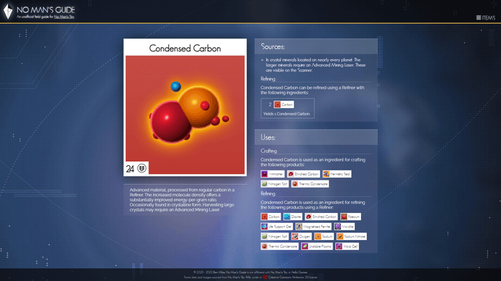

# No Man's Guide

A second-screen companion app for the game "No Man's Sky." A convenient way to find location, crafting, refining and cooking information for over one hundred in-game items (and growing). Future updates tentatively include translations for the various alien languages.

## Installation

1. Clone this repository and provision a web server for the project.
2. Make sure [Node.js](https://nodejs.org) and [NPM](https://www.npmjs.com) are installed.
3. In the project's root directory, run `npm install` in the terminal.

## Development

- It's recommended to use [VSCode](https://code.visualstudio.com/) with the [Volar](https://marketplace.visualstudio.com/items?itemName=Vue.volar) extension.
- For a live preview of the source code, run `npm run dev`.

## Deployment

- This repo uses GitHub Actions (with [this Workflow by Vite](https://vitejs.dev/guide/static-deploy.html#github-pages)) to automatically build and deploy to GitHub Pages whenever new code is pushed to the `master` branch. 
- You can also build locally by running `npm run build`, and you can preview that build with `npm run preview`.

## Special Thanks

- This project makes use of [Vanilla Tilt JS](https://micku7zu.github.io/vanilla-tilt.js/)
- This project is part of the [No Man's Sky Community Developers & Designers (NMSCD)](https://nmscd.com/) collection
- This project is tested with [BrowserStack](https://www.browserstack.com/)
